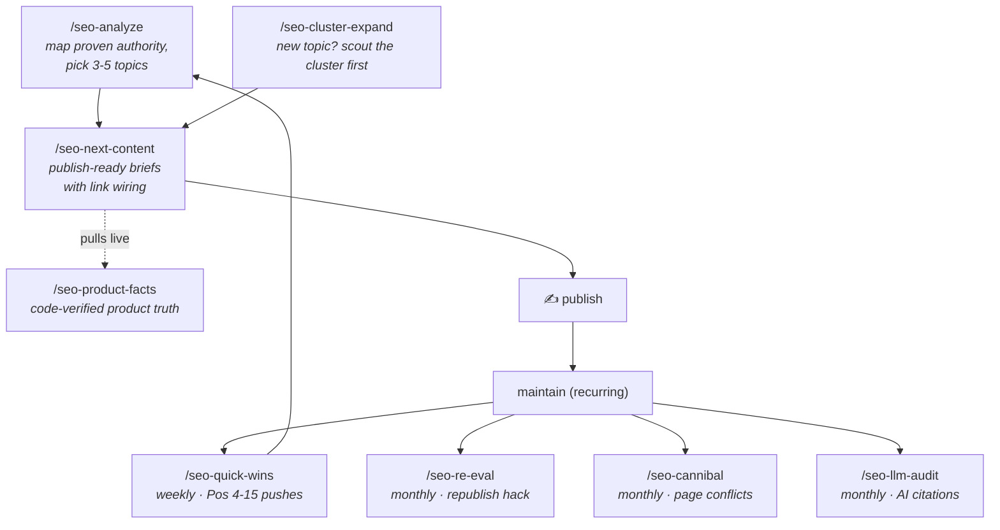

# The Workflow

The commands form one loop: **map your proven authority → publish into it → maintain what ranks**. Claude Code executes each step against live GSC + DataForSEO data; you make the calls.



## The cadence

| When | Command | What you get |
|---|---|---|
| Start / every ~6 weeks | `/seo-analyze yourdomain.com` | Your proven ranking ceiling + 3-5 prioritized topics that expand authority you already have |
| Per topic you green-light | `/seo-next-content yourdomain.com` | Publish-ready brief: slug, title, outline, internal links in+out, fact-checked product angle |
| Before any product claim | `/seo-product-facts` | Live code-extracted fact sheet (pricing, features, honest limitations) — runs automatically inside next-content |
| Weekly | `/seo-quick-wins yourdomain.com` | Pos 4-15 keywords one push from page one, with the ONE action each needs |
| Monthly | `/seo-re-eval yourdomain.com` | Old pages stuck at Pos 8-25 worth republishing under a new URL (NavBoost re-evaluation) |
| Monthly | `/seo-cannibal yourdomain.com` | Pages competing against each other for the same query, with merge/differentiate calls |
| Monthly | `/seo-llm-audit yourdomain.com` | Queries where LLMs cite you invisibly (Pos 1-10, zero clicks) — your AI-search footprint |
| Entering a new topic | `/seo-cluster-expand "seed keyword"` | The semantic neighborhood: what to push, what to thin-start, what to skip |
| A link/exchange offer comes in | `/seo-link-vet <their-domain>` | Accept / counter / decline verdict: does the linking page have real traffic, does the niche fit, is it a link farm |

One operational rule across all of it: **7-day cooldown** — never touch the same page twice within a week. GSC needs time to register each change, and stacked edits make cause-and-effect unreadable.

## The five principles behind it

These come from the [knowledge base](../knowledge-base/seo-knowledge-base.md) — the commands enforce them so you don't have to remember:

1. **Authority is page-level and proven, not a domain score.** The bar for "can we rank this?" is the highest difficulty you *already* rank top-7 for (your proven ceiling) — not DR. (Sections 1, 25)
2. **Bottom-of-funnel first.** "X vs Y", "best X for Y", "X alternative" — 400-800 words that position your product as the answer. Top-of-funnel traffic doesn't pay rent. (Section 9)
3. **Internal links are the cheapest authority you own.** Route from high-click hubs to Pos-4-20 pages, in-content, descriptive anchors, topically bridged. Never to Pos 1-3 (wasted) or Pos 95+ (evaporates). (Sections 5, 17)
4. **Publish thin, expand on proof.** 200-400 word starter pages; GSC tells you within weeks which ones deserve the full treatment. (Section 18)
5. **Never invent product facts.** Every claim in a brief traces to the live code extraction (`file:line`). Honest limitations convert better than fake features — and false claims propagate through LLMs. (`/seo-product-facts`)

## A realistic first month

```
Day 1    Setup (docs/setup.md) → /seo-analyze yourdomain.com
Day 1-7  Publish picks #1-2 via /seo-next-content (including the internal links it wires)
Day 7    /seo-quick-wins — execute the single highest-leverage action
Day 14   /seo-quick-wins again · publish pick #3
Day 21   /seo-quick-wins · /seo-cannibal (first conflict sweep)
Day 28   /seo-re-eval + /seo-llm-audit · re-run /seo-analyze if picks are exhausted
```

Expectation management (Section 19): new pages index in 1-2 weeks, reach Pos 10-15 in 4-8 weeks *if the internal linking is executed*, and get their real NavBoost evaluation over ~13 months of click data. SEO compounds; the loop is designed to be run, not admired.
